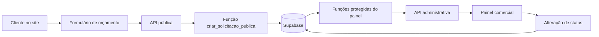

# Arquitetura e fluxo da aplicação

## Objetivo

O sistema transforma uma solicitação enviada no site em uma oportunidade acompanhada pela equipe comercial. A interface pública e o painel usam a mesma aplicação, mas possuem responsabilidades e níveis de acesso diferentes.

## Visão geral

## Fluxo de uma nova solicitação

1. O cliente preenche o formulário em `/contato`.
2. `QuoteForm` converte os campos em JSON e envia uma requisição para `/api/solicitacoes`.
3. A API limita o tamanho dos textos, verifica campos obrigatórios e aplica uma proteção simples contra robôs.
4. A API chama a função `criar_solicitacao_publica` do Supabase.
5. A função cria ou atualiza o cliente pelo WhatsApp, registra a solicitação com status `novo` e grava o primeiro item do histórico.
6. O painel consulta novamente os dados e apresenta a solicitação para a equipe.

## Fluxo de atualização do status

1. O administrador escolhe um status no painel.
2. O componente envia o identificador e o novo status à API administrativa.
3. A API confirma a identidade do usuário e valida se o status é permitido.
4. A função protegida do banco atualiza a solicitação.
5. O status anterior, o novo status e uma observação são registrados em `historico_status`.
6. A interface atualiza os cartões e o funil sem recarregar a página inteira.

## Fluxo de criação do orçamento

1. A equipe abre os detalhes de uma solicitação e informa descrição, quantidade e valor unitário.
2. A API administrativa valida os números e chama `salvar_item_orcamento_painel`.
3. A função cria ou atualiza o item garantindo que ele pertença à solicitação correta.
4. Ao salvar o primeiro item, uma solicitação nova ou em atendimento passa para `orcamento`.
5. Essa transição também é registrada no histórico de status.
6. A interface consulta os itens novamente e calcula subtotais e total para exibição.

## Divisão de responsabilidades

| Camada | Responsabilidade | Exemplos |
|---|---|---|
| Interface | Coletar dados e mostrar resultados | formulário e painel |
| API | Validar entradas e controlar acesso | rotas em `app/api` |
| Regras do banco | Executar operações consistentes e protegidas | funções RPC |
| Banco de dados | Armazenar clientes, solicitações e histórico | tabelas PostgreSQL |
| Hospedagem | Executar a aplicação e identificar o usuário | Sites/Cloudflare |

Essa separação facilita a manutenção: a tela não acessa as tabelas diretamente, e as regras críticas permanecem no backend e no banco.
