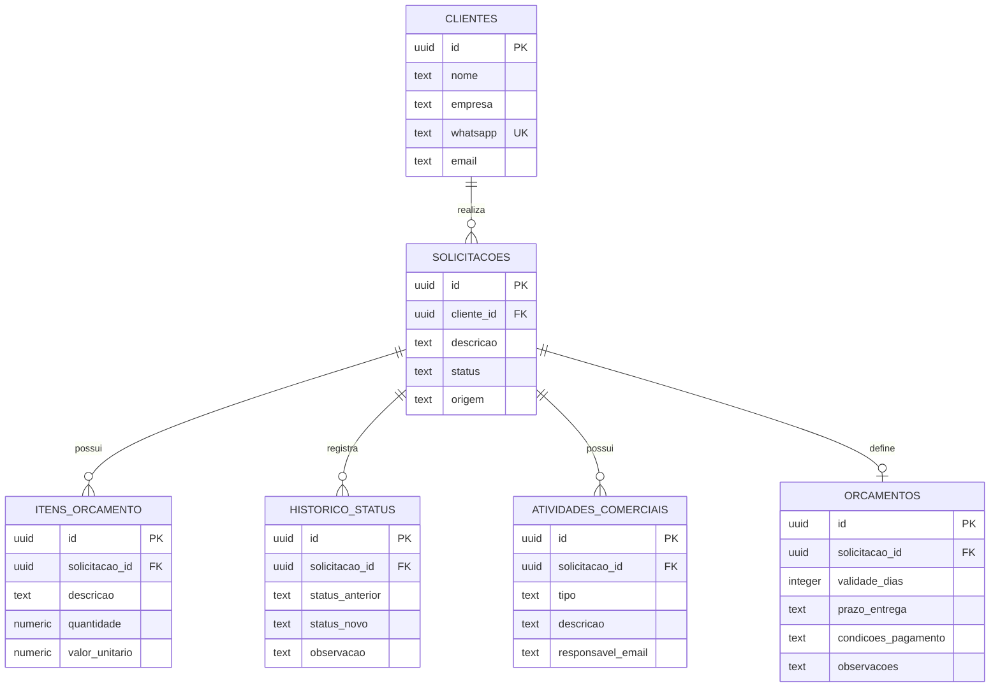

# Banco de dados e segurança

## Modelo atual

## Tabelas

- `clientes`: dados de contato. O WhatsApp é único e permite reconhecer um cliente já cadastrado.
- `solicitacoes`: necessidade descrita pelo cliente e etapa atual do atendimento.
- `itens_orcamento`: estrutura preparada para os produtos, quantidades e valores de uma proposta.
- `historico_status`: trilha das alterações realizadas durante o atendimento.
- `atividades_comerciais`: observações e eventos registrados pela equipe, com data e responsável.
- `private.painel_config`: guarda somente o hash da chave usada pelas funções administrativas.
- `orcamentos`: condições comerciais usadas na geração da proposta em PDF.

## Status comerciais

| Valor no banco | Significado |
|---|---|
| `novo` | solicitação recém-recebida |
| `em_atendimento` | equipe iniciou o contato ou a análise |
| `orcamento` | proposta em elaboração ou enviada |
| `negociacao` | condições sendo negociadas |
| `concluido` | atendimento finalizado com sucesso |
| `cancelado` | oportunidade encerrada sem continuidade |

## Decisões de segurança

O Row Level Security (RLS) está habilitado nas tabelas públicas. A chave publicável do Supabase pode participar das chamadas do site, mas não concede leitura direta das tabelas.

A gravação pública ocorre somente pela função `criar_solicitacao_publica`, que aceita os dados necessários e aplica as regras do processo em uma única transação.

As operações do painel exigem duas verificações:

1. a aplicação valida o e-mail autenticado contra `ADMIN_EMAILS` em produção;
2. o backend envia uma chave secreta para as funções administrativas do Supabase.

Essa chave não é enviada ao navegador. O banco armazena apenas seu hash SHA-256, reduzindo a exposição do valor original.

## Migrações

- `202609010001_initial_commercial_schema.sql`: cria tabelas, índices, RLS e o cadastro público.
- `202609010002_dashboard_access.sql`: cria a configuração privada e as funções do painel.
- `202609010003_quote_items.sql`: cria as funções protegidas de consulta, gravação e remoção dos itens do orçamento.
- `202609010004_proposal_details.sql`: cria os dados comerciais e as funções protegidas usadas pelo gerador de proposta.
- `202609010005_commercial_history.sql`: cria atividades comerciais e a linha do tempo unificada do atendimento.

As migrações documentam a evolução do banco e permitem reproduzir sua estrutura em outro ambiente.
